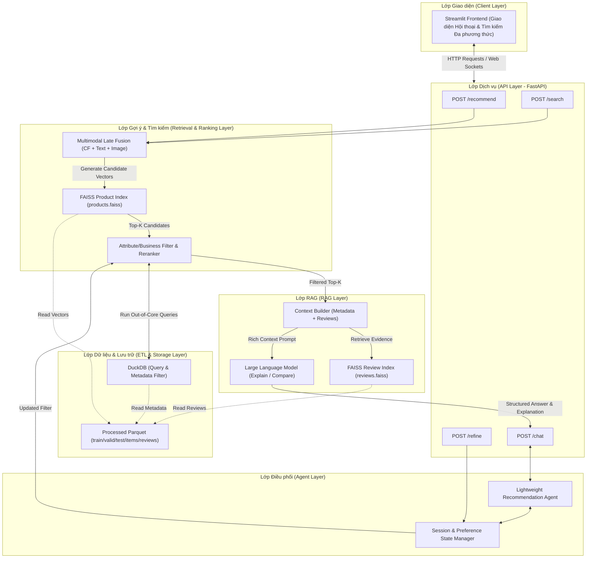

# Hợp đồng Phát triển Hệ thống (AGENT.md)

Tài liệu này đóng vai trò là **Hợp đồng Thiết kế (Design Contract) và Ràng buộc Phát triển (Development Constraints)** cho dự án **"Xây dựng hệ thống gợi ý sản phẩm đa phương thức ứng dụng RAG"**. Mọi Agent AI (bao gồm Antigravity) và lập trình viên tham gia phát triển dự án này bắt buộc phải tuân thủ nghiêm ngặt các điều khoản dưới đây để đảm bảo sản phẩm cuối cùng là một **HỆ THỐNG** hoàn chỉnh, tối ưu và đáng tin cậy, không chỉ là các mô hình đơn lẻ.

---

## 1. Tầm nhìn Kiến trúc Hệ thống (System Architecture Vision)

Hệ thống được thiết kế theo mô hình phân lớp rõ ràng, đảm bảo tính mô-đun hóa, khả năng thay thế linh hoạt (plug-and-play) và khả năng mở rộng. 

---

## 2. 6 Trụ cột Hệ thống bắt buộc (6 Core Pillars Contract)

Mọi đóng góp mã nguồn (PR/Code Edit) phải phục vụ và tuân thủ định nghĩa của 6 trụ cột dưới đây:

### Trụ cột 1: Pipeline xử lý dữ liệu (ETL & Data Pipeline)
*   **Tiêu chuẩn:** Dữ liệu thô phải được xử lý tự động qua luồng ETL tối ưu bộ nhớ. Tuyệt đối không xử lý ad-hoc bằng Pandas trong RAM lớn hơn giới hạn.
*   **Quy định kỹ thuật:**
    *   Sử dụng [Polars](file:///d:/WorkSpace/Work/DATN/src/datn/data/pipeline.py) streaming và lưu trữ dưới dạng Parquet để phân nhỏ bộ nhớ tạm.
    *   Sử dụng [DuckDB](file:///d:/WorkSpace/Work/DATN/src/datn/data/cli.py) cho việc phân tích và truy vấn out-of-core.
    *   Phải chạy **Chronological leave-last-out split** trên chuỗi tương tác của từng user để tránh rò rỉ tín hiệu tương lai (data leakage) vào tập huấn luyện.
    *   Mọi thông số, seed, và checksum của tập dữ liệu sau khi lọc (K-core, positive interactions $\ge$ 4) phải được lưu trữ trong `dataset_manifest.json` để phục vụ khả năng tái lập.

### Trụ cột 2: Vector Indexing & Hybrid Retrieval
*   **Tiêu chuẩn:** Hệ thống phải hỗ trợ tìm kiếm ngữ nghĩa thời gian thực trên không gian biểu diễn đa phương thức (Multimodal Representation) kết hợp bộ lọc thuộc tính cứng.
*   **Quy định kỹ thuật:**
    *   Embeddings của văn bản (`text_embeddings.npy`) và hình ảnh (`image_embeddings.npy`) thu được từ pretrained CLIP-family encoder phải được chuẩn hóa (normalize) trước khi lưu.
    *   Index tìm kiếm tương đồng phải sử dụng thư viện hiệu năng cao như **FAISS** (`products.faiss` và `reviews.faiss`).
    *   Quy trình tìm kiếm bắt buộc phải hỗ trợ **Hybrid Retrieval**: Lọc trước hoặc lọc sau các điều kiện cứng như khoảng giá (price), danh mục (category), thương hiệu (brand) bằng DuckDB/SQL trước khi trả về danh sách ứng viên Top-K.

### Trụ cột 3: Core Recommendation & RAG Engine
*   **Tiêu chuẩn:** Phân tách rõ ràng giữa thuật toán gợi ý (Recommender) và tác vụ sinh ngôn ngữ tự nhiên (RAG).
*   **Quy định kỹ thuật:**
    *   **Candidate Generation (Retrieval):** Sử dụng công thức phối hợp muộn (Late Fusion) để tính toán độ tương đồng tổng hợp:
        $$E_{\text{content}} = \alpha E_{\text{image}} + \beta E_{\text{text}}$$
        $$E_{\text{final}} = \lambda E_{\text{cf}} + (1 - \lambda) E_{\text{content}}$$
        Hệ số $\alpha, \beta, \lambda$ phải được tối ưu trên tập Validation.
    *   **Reranking:** Loại bỏ các sản phẩm đã tương tác trong tập huấn luyện (nếu giao thức yêu cầu) và áp dụng các bộ lọc nghiệp vụ.
    *   **RAG Context Builder:** Trích xuất metadata sản phẩm + $N$ review có điểm `helpful_vote` cao nhất từ `reviews.parquet` (thông qua `reviews.faiss` index) có cùng `item_id`.
    *   **LLM Prompting:** Chỉ chuyển thông tin ngữ cảnh đã truy xuất và profile người dùng vào prompt. **LLM không được tự ý sinh thông tin về giá cả, thông số kỹ thuật hoặc các review không có trong ngữ cảnh được cung cấp (chống Hallucination).**

### Trụ cột 4: Session & State Management
*   **Tiêu chuẩn:** Hội thoại gợi ý phải có tính nhất quán qua các lượt chat (multi-turn conversational recommendation).
*   **Quy định kỹ thuật:**
    *   Hệ thống phải duy trì một `Session State` lưu trữ: `user_profile`, lịch sử hội thoại hiện tại, và cấu trúc preference hiện tại (ví dụ: `color: black, max_price: 100`).
    *   Khi người dùng cập nhật yêu cầu (ví dụ: *"Tìm cái tương tự nhưng rẻ hơn"*), hệ thống phải sử dụng parser để trích xuất intent, cập nhật cấu trúc preference và gọi lại bộ lọc/reranker trên tập ứng viên có sẵn mà không được huấn luyện lại mô hình (retrain).

### Trụ cột 5: API & Serving Layer
*   **Tiêu chuẩn:** Đóng gói toàn bộ chức năng của hệ thống dưới dạng API phi trạng thái (stateless APIs) và xây dựng giao diện tương tác trực quan.
*   **Quy định kỹ thuật:**
    *   Sử dụng **FastAPI** để xây dựng backend với các endpoint được chuẩn hóa:
        *   `POST /recommend`
        *   `POST /search`
        *   `POST /refine`
        *   `POST /explain`
        *   `POST /compare`
        *   `POST /chat`
    *   Sử dụng **Streamlit** để phát triển MVP Frontend để demo trọn vẹn luồng tương tác đa phương thức (upload ảnh tìm kiếm, chat nhận gợi ý và xem giải thích).

### Trụ cột 6: Thử nghiệm & Đánh giá (System Evaluation)
*   **Tiêu chuẩn:** Toàn bộ hệ thống phải được đánh giá định lượng bằng các độ đo học thuật chuẩn.
*   **Quy định kỹ thuật:**
    *   **Recommendation Metrics:** Sử dụng `Recall@10`, `NDCG@10`, `HitRate@10`. Thực hiện đánh giá phân rã (ablation study) khi loại bỏ từng modality (CF, Text, Image) và đánh giá riêng cho nhóm sản phẩm ít tương tác (cold-start / sparse items $\le 5$ hoặc $\le 10$ interactions).
    *   **RAG Metrics:** Đánh giá chất lượng sinh bằng các bộ khung kiểm thử tự động (Ragas / TruLens) trên các khía cạnh:
        *   *Faithfulness* (Độ trung thực của câu trả lời so với ngữ cảnh trích xuất).
        *   *Answer Relevance* (Mức độ đáp ứng đúng câu hỏi của người dùng).
        *   *Context Recall* (Mức độ trích xuất đầy đủ thông tin cần thiết từ reviews/metadata).

---

## 3. Ràng buộc Phát triển và Triển khai (Development Constraints)

1.  **Tính độc lập của Core Service:**
    *   Mô hình gợi ý (FAISS, RecBole) và API truy xuất phải hoạt động bình thường ngay cả khi không có kết nối tới LLM (hoặc LLM bị quá tải/gặp lỗi). Trong trường hợp đó, hệ thống sẽ trả về danh sách sản phẩm thuần túy và không kèm lời giải thích tự nhiên.
2.  **Cấu trúc thư mục quy chuẩn:**
    *   Mã nguồn dự án bắt buộc phải tuân theo sơ đồ mô-đun hóa:
        *   [`src/datn/data/`](file:///d:/WorkSpace/Work/DATN/src/datn/data/): ETL và data pipeline.
        *   `src/datn/features/`: Trích xuất đặc trưng đa phương thức (embeddings).
        *   `src/datn/recommenders/`: Các mô hình baseline và late fusion.
        *   `src/datn/retrieval/`: FAISS index và truy xuất hybrid.
        *   `src/datn/rag/`: Đóng gói prompt, liên kết LLM và sinh văn bản giải thích.
        *   `src/datn/agent/`: Logic điều phối hội thoại (conversational agent) và quản lý session.
        *   `src/datn/api/`: Các FastAPI routes.
        *   `src/datn/evaluation/`: Code tính toán metrics và chạy ablation test.
3.  **Quy trình Commit & Thử nghiệm:**
    *   Không được sửa đổi dữ liệu đã đóng băng trong `data/processed/` mà không cập nhật `dataset_manifest.json` và tạo một phiên bản dataset mới.
    *   Mọi thực nghiệm so sánh mô hình phải sử dụng cấu hình chung (hyperparameters, seed) lưu tại `configs/` và xuất kết quả ra tệp tin CSV/JSON kèm theo hình vẽ biểu đồ để đảm bảo khả năng tái lập.

---

## 4. Hướng dẫn cho AI Agent (Agent Execution Guidelines)

Khi nhận được yêu cầu phát triển hoặc gỡ lỗi (debugging) từ người dùng:
1.  **Đọc Hợp đồng:** Luôn tham chiếu đến file [`AGENT.md`](file:///d:/WorkSpace/Work/DATN/AGENT.md) này để kiểm tra xem thay đổi có vi phạm các ràng buộc thiết kế không.
2.  **Phát triển Module:** Viết code có cấu trúc, tách biệt concerns rõ ràng. Tuyệt đối không chèn mã xử lý dữ liệu nặng vào các file API hoặc chèn logic gọi API trực tiếp vào các hàm xử lý dữ liệu.
3.  **Tái cấu trúc (Refactoring):** Khi đề xuất thay đổi kiến trúc lớp gợi ý hoặc lớp RAG, bắt buộc phải cập nhật sơ đồ Mermaid trong tài liệu này để phản ánh chính xác luồng dữ liệu mới.
4.  **Bảo vệ dữ liệu:** Nghiêm cấm mọi hành vi rò rỉ dữ liệu (data leakage) giữa tập train và test. Tuyệt đối không dùng split ngẫu nhiên nếu không được yêu cầu.

---
*Tài liệu này được phê duyệt bởi chủ dự án và là điều khoản bắt buộc cho mọi hoạt động đóng góp mã nguồn.*
