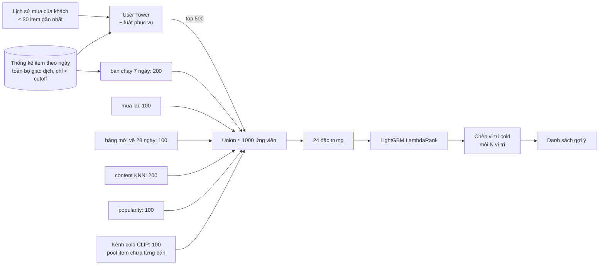

# H&M — Phương pháp

> Cập nhật 05/10/2026. Mô tả đúng theo mã trong `notebooks/hm/02_hm_retrieval.ipynb` (tower, luật phục vụ, refit) và `03_hm_reranking_evaluation.ipynb` (ứng viên, đặc trưng, reranker, kênh cold). Siêu tham số mặc định lấy từ các notebook đó; bảng tổng hợp ở mục 9.

## 1. Kiến trúc tổng thể

Ba lớp, mỗi lớp trả lời một câu hỏi khác nhau:
1. **User Tower** (đa phương thức, học từ chuỗi mua): *khách này thích kiểu item nào?*
2. **Ứng viên + đặc trưng thời gian + LightGBM**: *trong các item đang có thể được mua tuần tới, cái nào cần xếp trên?*
3. **Chính sách cold**: *dành bao nhiêu chỗ cho item chưa từng bán?*

## 2. User Tower

### 2.1. Biểu diễn item
Với item `i` (chỉ số 1..105.542; 0 = padding):

`v_i = normalize( σ(g_id) · E_id[i] · keep_i  +  W_t · t_i  +  σ(g_img) · W_m · m_i )`

* `t_i`, `m_i`: embedding Jina CLIP v2 (text, ảnh) 512 chiều, **cố định**, chỉ học hai phép chiếu tuyến tính `W_t, W_m ∈ R^{512→128}` (không bias).
* `E_id ∈ R^{105.543×128}`: embedding ID khởi tạo N(0,1). Cổng `g_id` khởi tạo −2 (`σ ≈ 0,12`): ID là *residual nhỏ* lúc đầu để không lấn át nội dung. Cổng ảnh `g_img` khởi tạo 0 (`σ = 0,5`).
* `keep_i ∈ {0,1}` là mặt nạ suy luận cho cold-fix (mục 2.4); khi train thay bằng ID-dropout.
* Cho phép đổi `HM_MODALITY ∈ {id, text, image, multimodal}` để ablation: `id` chỉ dùng thành phần ID, `text` chỉ `W_t t_i`, `image` chỉ `W_m m_i`.

### 2.2. Biểu diễn khách và điểm
Lịch sử `h_1..h_L` (`L ≤ 30`, căn phải, đệm 0 bên trái). Trọng số tuyến tính theo độ mới `w_j = j`:

`q_u = normalize( Σ_j w_j v_{h_j} / Σ_j w_j )`, điểm `s(u,i) = q_u · v_i`.

Không dùng Transformer/attention (ghi nhận là hướng mở rộng, xem `05`).

### 2.3. Huấn luyện
* **Cặp huấn luyện**: với khách có nhiều ngày mua, mỗi item mua ở ngày `d ≥ 2` là một đích, lịch sử = mọi item các ngày trước (không dựng thứ tự giả giữa các item cùng ngày). Khách chỉ mua trong 1 ngày nhưng ≥ 2 món: lịch sử = các món còn lại trong giỏ (tín hiệu co-purchase). Tổng 985.376 cặp trên cửa sổ train.
* **Hàm mất mát**: sampled softmax với 1 dương + 128 âm. Âm lấy theo `(degree + 1)^0,75` trên toàn catalog (không trộn uniform: `HM_UNIFORM_NEG_RATIO = 0`), loại item đích hiện tại và các item trong lịch sử của chính khách (rejection sampling trên GPU bằng `torch.multinomial`). Nhiệt độ 0,07. **Không dùng hiệu chỉnh Log-Q** (tuỳ chọn này từng có ở bản v1, mặc định tắt, đã gỡ ở v2).
* AdamW (`lr = 1e-3`, `weight_decay = 1e-4`), batch 512, cắt gradient 5, tối đa 8 epoch (profile `quick`), kiên nhẫn 3 epoch. Mỗi epoch ≈ 75 giây (Kaggle) / ≈ 99 giây (RTX 3050 4GB).
* **Chọn epoch**: Recall@100 trên cửa sổ selection, context = train. Lưu ý: bước này luôn áp ngưỡng cold-fix `min_degree = 1` (nếu `HM_COLD_FIX=1`) trong khi ngưỡng cuối cùng được chọn *sau đó* (mục 2.4); hai cấu hình có thể lệch nhau, ghi nhận như một hạn chế nhỏ.

### 2.4. Cold-start ở mức mô hình: ID-dropout và cold-fix
**Vấn đề (bản v1).** Hàng ID của item *chưa từng là đích dương* không bao giờ nhận gradient dương; nó giữ nguyên giá trị khởi tạo ngẫu nhiên và vẫn được cộng vào `v_i` ⇒ vector item cold bị nhiễu và nằm lệch khỏi không gian của item warm. Hệ quả đo được (4 epoch, test): trên đích cold, 1+99 uniform cho HR@10 = 0,033 — thấp hơn random (≈ 0,09) — và full-ranking Hit@100 = 0,0007.

**ID-dropout (`HM_ID_DROPOUT = 0,3`).** Ở mỗi bước, mỗi hàng của bảng item bị bỏ thành phần ID với xác suất 0,3 (cùng một bảng cho query và ứng viên trong bước đó). Nhánh nội dung buộc phải tự phân biệt item ⇒ item chỉ có nội dung (cold) nằm cùng không gian với item warm.

**Cold-fix lúc suy luận.** Đặt `keep_i = 0` cho item có `degree < T` (degree = số lần mua trong tập fit). `T ∈ {0 (tắt), 1, 2, 3, 5, 10}` chọn bằng Recall@100 trên cửa sổ selection. Kết quả: nếu mô hình *không* có ID-dropout, tắt ID làm sụp đổ (Recall@100 0,060 → 0,019 ở `T = 1`); với ID-dropout chỉ giảm ≈ 10%. Ở lần chạy cuối cùng, `T = 0` (không tắt) được chọn vì việc tắt ID đẩy ~34 nghìn item không hoạt động lên top-100.

### 2.5. Luật phục vụ có nhận thức thời gian (suy luận, không đổi trọng số)
Tower thuần xếp hạng cả catalog trong khi mỗi tuần chỉ vài nghìn item đang bán. Điểm phục vụ:

`s'(u,i) = s(u,i) + w · log(1 + c7_i) + b · 1[degree_i = 0]`, và `s' = −∞` nếu `i` không có giao dịch trong `D` ngày trước cutoff (khi `D > 0`).

`c7_i` = số giao dịch của `i` trong 7 ngày trước cutoff (mục 5 của `01`). Ba tham số `(D, b, w)` quét lưới trên **cửa sổ valid** bằng Recall@100 (mô hình base chưa thấy valid): `D ∈ {0, 14, 28}`, `b ∈ {0, 0,05, 0,1, 0,2}`, `w ∈ {0, 0,02, 0,05, 0,1, 0,2, 0,3, 0,5}`; khi hoà ưu tiên `b` nhỏ. Kết quả lần cuối: `D = 0, b = 0,2, w = 0,1`.

*Vì sao quét ở valid chứ không ở selection*: theo định nghĩa mọi item bán trước cửa sổ selection đều đã có trong train, nên ở đó không có item cold đang bán và `b` không có tác dụng (cold Hit@100 = 0 với mọi `b`); quét ở selection luôn chọn `b = 0`. Hệ quả: số **valid** của tower không còn "sạch" cho ba tham số này; số **test** vẫn sạch.

Với `w > 0`, bộ lọc `D` gần như dư thừa (3 giá trị `D` cho cùng kết quả ở `b = 0,2, w = 0,1`).

## 3. Refit cho test
Tower base (train trên cửa sổ train, chọn epoch trên selection) dùng cho valid. Cho test, train lại **từ đầu** trên `train + selection + valid` với đúng `best_epoch` epoch (7) và cùng `(T, D, b, w)`. Item xuất hiện trong hai tuần cuối trở thành warm (tỉ lệ đích cold của test giảm 29,2% → 10,2%). Reranker không được thấy nhãn selection/valid của tower: reranker train trên nhãn selection với tower **base** (chưa thấy nhãn đó); để dự đoán test, reranker dùng điểm của tower refit — điểm tower được chuẩn hoá theo từng khách (z-score trên toàn catalog và hạng thật) để lệch thang giữa hai tower không làm hỏng đặc trưng.

## 4. Sinh ứng viên (notebook 03)
Mỗi khách nhận hợp (có khử trùng, giữ thứ tự ưu tiên) từ 7 nguồn; **không bao giờ chèn nhãn vào ứng viên**.

| Nguồn | K | Định nghĩa |
|---|---:|---|
| `tower` | 500 | Top-K theo điểm phục vụ `s'` (mục 2.5) |
| `recent` | 200 | Top theo bán chạy 7 ngày trước cutoff (giống nhau mọi khách) |
| `repeat` | 100 | Item khác nhau gần nhất trong lịch sử khách |
| `new` | 100 | Item có `first_seen ∈ [c−28, c)`, xếp theo cosine nội dung với 3 item gần nhất |
| `content` | 200 | Top theo cosine nội dung của toàn catalog với trung bình 3 item gần nhất |
| `popular` | 100 | Top popularity toàn thời gian trước cutoff |
| `cold` | 100 | Kênh cold CLIP (mục 5) |

Union ≈ 1.000 ứng viên/khách (997–1.001 ở lần chạy cuối).

## 5. Kênh cold dựa trên CLIP (item chưa từng bán)
Với item chưa có giao dịch nào, mọi tín hiệu tương tác đều bằng 0; chỉ còn nội dung. Hai tín hiệu CLIP (vector nội dung `c_i = normalize(normalize(t_i) + normalize(m_i))`):
1. **Độ giống với hồ sơ khách**: cosine giữa `c_i` và `normalize(Σ c_h)` trên 10 item gần nhất của khách.
2. **Prior "sắp được bán"** `launch_prior_i`: trung bình top-10 cosine giữa `c_i` và các item *mới ra* trong 56 ngày trước cutoff (cùng bộ sưu tập/mùa với hàng mới ra gần đây).

Pool = item có `first_seen ≥ c`. Điểm kênh = `0,5·z(độ giống khách) + z(prior)` (z-score trong pool, theo từng khách); lấy top-100. `launch_prior` cũng là một đặc trưng của reranker (tính cho mọi item, chuẩn hoá theo pool).

Bằng chứng độc lập (thăm dò, `scripts/hm/probe_cold_clip.py`): trong pool 33.013 item, với 611 khách có đích thuộc pool, Hit@100 *trong pool*: random ≈ 0,005 · chỉ độ giống khách 0,038 · chỉ prior 0,038 · tổ hợp trên 0,092.

## 6. Đặc trưng của reranker (24)
Tất cả tính tại thời điểm dự đoán, dùng thống kê chỉ trước cutoff `c` của cửa sổ; `featurize()` dùng được cho *bất kỳ* item (kể cả âm tính của giao thức 1+99).

| # | Đặc trưng | Định nghĩa |
|---|---|---|
| 1 | `tower_z` | `(s − μ_u)/σ_u`, μ/σ trên toàn catalog của khách (điểm thô, không phải `s'`) |
| 2 | `tower_logrank` | `log(1 + #item có điểm tower cao hơn)` |
| 3 | `log_pop_all` | `log(1 + pop_all(c))` |
| 4 | `log_pop_recent` | `log(1 + pop_recent(c))` |
| 5 | `recent_share` | `pop_recent / (pop_all + 1)` |
| 6 | `content_anchor` | cosine nội dung với trung bình 3 item gần nhất |
| 7 | `content_mean` | cosine nội dung với trung bình 30 item gần nhất |
| 8–13 | `from_tower, from_recent, from_repeat, from_new, from_content, from_popular` | cờ thành viên nguồn ứng viên |
| 14 | `is_cold` | `degree = 0` theo tower đang dùng |
| 15 | `repeat_count` | `log(1 + số lần khách đã mua item)` |
| 16 | `age_days` | `clip(age, −1, 800)/100` (−1: chưa bán) |
| 17 | `seen_before` | `first_seen < c` |
| 18–20 | `type_aff, dept_aff, colour_aff` | tỉ lệ 30 item gần nhất cùng `product_type` / `department` / `colour_group` với item |
| 21 | `same_type_last` | cùng `product_type` với item gần nhất |
| 22 | `log_price_ratio` | `log(giá item / giá TB 30 item gần nhất)` |
| 23 | `from_cold` | cờ kênh cold |
| 24 | `launch_prior` | prior mục 5 |

Bộ **7 đặc trưng kiểu v1** để ablation: `tower_z, log_pop_all, content_anchor, from_tower, from_popular, from_repeat, from_content` (cùng tập ứng viên v2, chỉ khác đặc trưng).

## 7. Reranker
* **LightGBM LambdaRank** (`objective = lambdarank`, `metric = ndcg@12`, `lr = 0,05`, `num_leaves = 63`, `min_data_in_leaf = 50`, `feature_fraction = 0,8`, `bagging_fraction = 0,8`, `bagging_freq = 1`, `lambda_l2 = 1`, seed theo `run_config`).
* **Nhãn**: item thực sự mua trong cửa sổ đích, trong các ứng viên. Nhóm = một khách; nhóm không có dương trong union bị bỏ khi train (bản chạy cục bộ: 1.727 nhóm, 1.789.266 dòng, 2.844 dương).
* **Dữ liệu train**: cửa sổ selection (tower base chưa thấy nhãn này). **Dừng sớm** theo NDCG@12 trên valid (kiên nhẫn 60 vòng): 84 vòng (v2) / 53 vòng (7 đặc trưng).
* **Refit ranker cho test**: gộp nhóm selection + valid, train đúng `⌊1,1 × vòng_tốt_nhất⌋` vòng (92). Test chưa được dùng.
* Phương án dự phòng MLP (khi không có `lightgbm`) có trong mã nhưng không dùng ở kết quả cuối.

## 8. Chính sách chèn vị trí cho cold
Ranker không học được cách đẩy item chưa từng bán lên top (nhãn quá hiếm và điểm tương tác bằng 0). Chính sách đơn giản: giữ thứ tự reranker nhưng dành các vị trí `N, 2N, 3N…` cho item của kênh cold (theo thứ tự điểm CLIP của kênh); `N ∈ {10, 5}` (`HM_COLD_EVERY`), `N = 0` tắt. Đánh đổi độ chính xác tổng lấy độ phủ cold được định lượng ở `03` (mục E11).

## 9. Siêu tham số (mặc định, profile `quick`)

| Thành phần | Tham số | Giá trị |
|---|---|---|
| Embedding | Mô hình / chiều | Jina CLIP v2 / 512 (FP32, chuẩn hoá) |
| Tower | `D_MODEL`, `MAXLEN` | 128, 30 |
| Tower | Âm / nhiệt độ / batch | 128 / 0,07 / 512 |
| Tower | Tối ưu | AdamW, `lr 1e-3`, `wd 1e-4`, clip 5 |
| Tower | Epoch tối đa / kiên nhẫn / epoch chọn | 8 / 3 / 7 |
| Tower | ID-dropout | 0,3 |
| Tower | Lưới cold-fix `T` | {0,1,2,3,5,10}; chọn 0 |
| Tower | Lưới luật phục vụ | `D` {0,14,28} × `b` {0,0,05,0,1,0,2} × `w` {0…0,5}; chọn (0, 0,2, 0,1) |
| Ứng viên | K các nguồn | 500 / 200 / 100 / 100 / 200 / 100 / 100 |
| Kênh cold | `PRIOR_DAYS`, `PRIOR_TOPK`, hệ số khách | 56, 10, 0,5 |
| Ranker | Thư viện / mục tiêu | LightGBM / LambdaRank |
| Ranker | Vòng (v2 / 7 đặc trưng) | 84 / 53; refit 92 |
| Đánh giá | Âm 1+99 | 99, `uniform` và `popularity` |
| Chèn cold | `HM_COLD_EVERY` | 0, 10, 5 (báo cáo cả ba) |
| Seed | `run_config.seed` | 20260922 |

Toàn bộ đều điều chỉnh bằng biến môi trường `HM_*` (xem `04_notebook_guide.md`).

## 10. Điểm cần lưu ý khi viết luận văn
* Tower **không** phải thành phần quyết định chất lượng cuối cùng; reranker với đặc trưng thời gian đóng góp phần lớn (xem `03`, mục E12 và ablation 7 đặc trưng).
* Thống kê item toàn cục là một giả định hệ thống (có sẵn khi triển khai) cần được nêu rõ như một thành phần của phương pháp.
* Ba tham số luật phục vụ chọn trên valid; số valid của tower không dùng làm kết quả độc lập.
* Cold-start *người dùng* và *ablation modality (id/text/image/multimodal)* chưa được thực hiện trên H&M (xem `05`).
