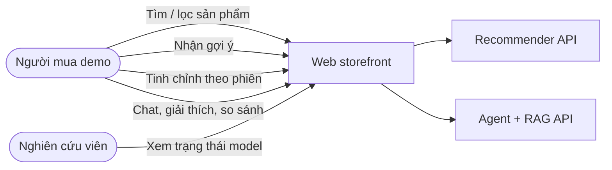
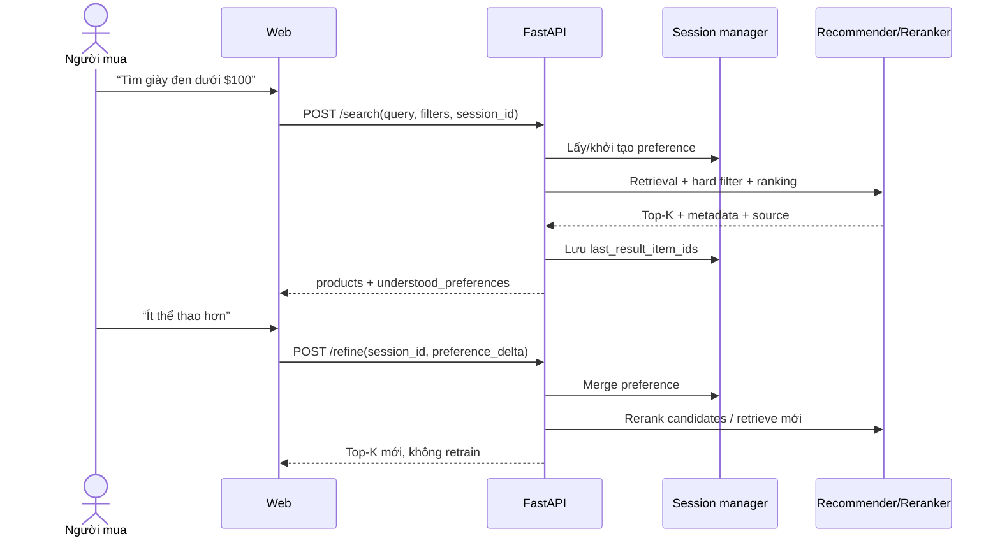
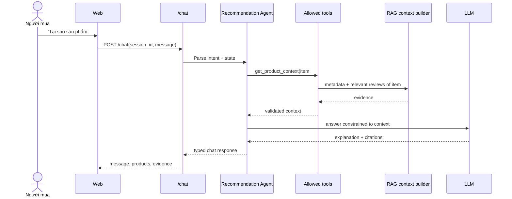
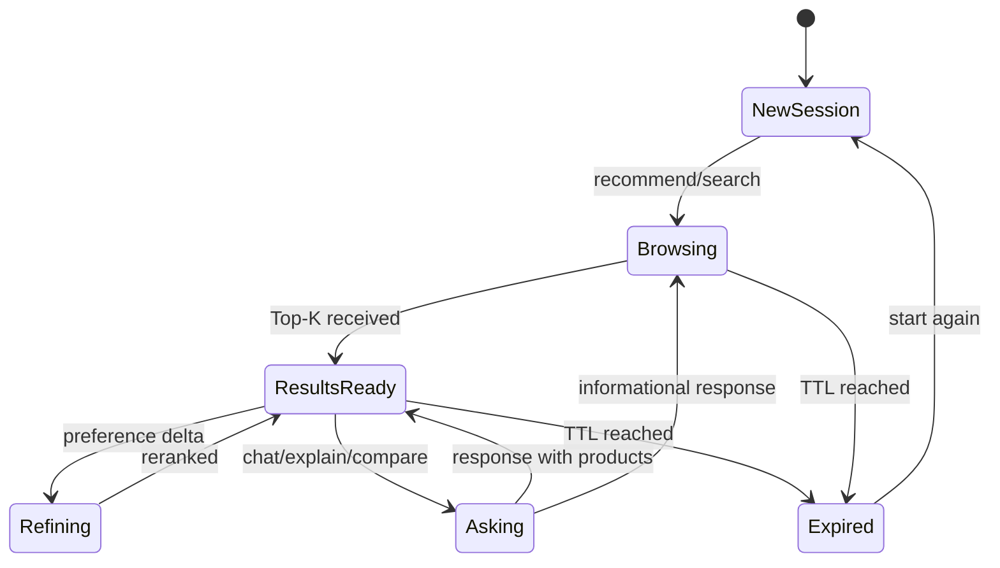
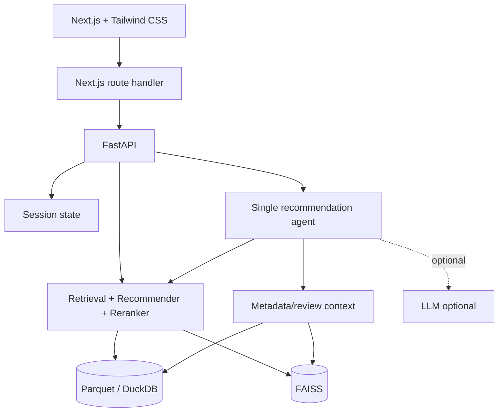

# UML cho web demo

Các biểu đồ dùng Mermaid để render trực tiếp trong Markdown và dễ đồng bộ với tài liệu luận văn.

## Use-case diagram

## Sequence — refinement tuần tự

## Sequence — chatbot agentic có evidence

## State — session trên web

## Component diagram

