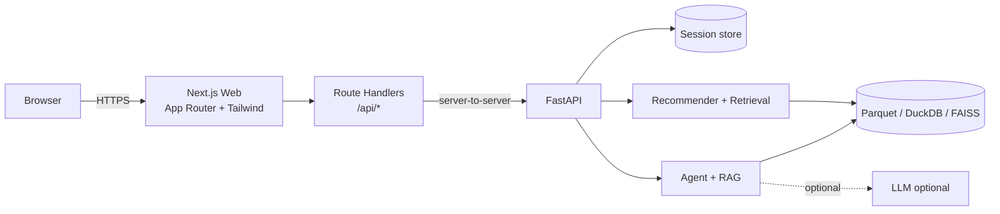

# Kiến trúc triển khai web: FastAPI + Next.js + Tailwind CSS

## 1. Quyết định kiến trúc

| Tầng | Công nghệ chốt | Trách nhiệm |
|---|---|---|
| Frontend | Next.js App Router, React, TypeScript strict, Tailwind CSS | UI responsive, interaction state, accessibility, render card/chat/compare |
| BFF nhẹ | Next.js Route Handlers | Same-origin proxy, chuẩn hóa lỗi UI, không thực hiện ranking hay gọi LLM trực tiếp |
| Backend | `backend/app/` — FastAPI + Pydantic + SQLAlchemy | Marketplace API, auth, catalog, cart, orders, gateway và health |
| AI core | Recommender, retrieval, RAG, single agent | Theo ràng buộc nghiên cứu; backend mới là caller |
| Data | Parquet/DuckDB, FAISS, artifact checkpoint | Chỉ AI core/backend đọc |

Next.js không thay thế FastAPI. Nó là presentation layer; marketplace FastAPI giữ business logic/transaction. Recommender training và serving tiếp tục là service độc lập, giao tiếp qua HTTP; marketplace không import `src/datn/`, DuckDB hay FAISS.

## 2. Deployment / container diagram



## 3. Cấu trúc thư mục frontend đề xuất

```text
web/
├── app/
│   ├── page.tsx                 # storefront/home
│   ├── assistant/page.tsx       # chat shopping assistant
│   ├── compare/page.tsx         # comparison view
│   └── api/[...path]/route.ts   # proxy tới FastAPI
├── components/
│   ├── product-card.tsx
│   ├── product-grid.tsx
│   ├── search-filters.tsx
│   ├── chat-panel.tsx
│   └── evidence-list.tsx
├── lib/
│   ├── api.ts                   # typed client tới same-origin API
│   ├── schemas.ts               # type/schema dùng chung
│   └── demo-fixtures.ts         # chỉ dùng demo mode
├── public/
├── package.json
├── tailwind.config.ts
└── tsconfig.json
```

Backend độc lập nằm tại `backend/`, có `backend/docker-compose.yml` chạy PostgreSQL và Qdrant. Không đưa mã marketplace vào `src/datn/` vì thư mục đó dành cho ETL/train/evaluation.

Server Components dùng cho layout/nội dung tĩnh; Client Components chỉ dùng ở search/filter, compare selection và chat. Không đưa session secret hay model metadata nhạy cảm vào client bundle.

## 4. Luồng request và session

1. Browser gọi `/api/search` hay `/api/chat` cùng `session_id`.
2. Next.js route handler forward body tới `DATN_API_BASE_URL` ở server.
3. FastAPI validate Pydantic, đọc/ghi session state và gọi core service.
4. FastAPI trả `request_id`, `source`, version artifact (nếu có) và data schema.
5. Next.js chuyển response cho browser; UI render loading/success/error states.

`session_id` có thể do FastAPI tạo ở response đầu tiên. Frontend không tự suy luận preference hoặc rank; chỉ hiển thị `understood_preferences` và products do backend trả về.

## 5. Quy ước môi trường

| Biến | Nơi dùng | Ý nghĩa |
|---|---|---|
| `DATN_API_BASE_URL` | Next.js server/route handler | URL FastAPI nội bộ, ví dụ `http://api:8000` |
| `NEXT_PUBLIC_DEMO_MODE` | Browser | Cho phép fixture demo, chỉ nhận `true`/`false` |
| `NEXT_PUBLIC_APP_NAME` | Browser | Tên hiển thị, không nhạy cảm |

Không dùng `NEXT_PUBLIC_` cho API key, URL nội bộ cần che, model/index path hay biến môi trường LLM.

## 6. Lựa chọn không dùng

- Không gọi FastAPI trực tiếp từ mọi client component: tránh CORS phức tạp, phân tán lỗi và lộ cấu hình nội bộ.
- Không để Next.js truy cập FAISS/Parquet hay gọi LLM: phá vỡ tách lớp và khiến fallback khó kiểm soát.
- Không dùng microservice hoặc message queue: vượt quá phạm vi đồ án.
