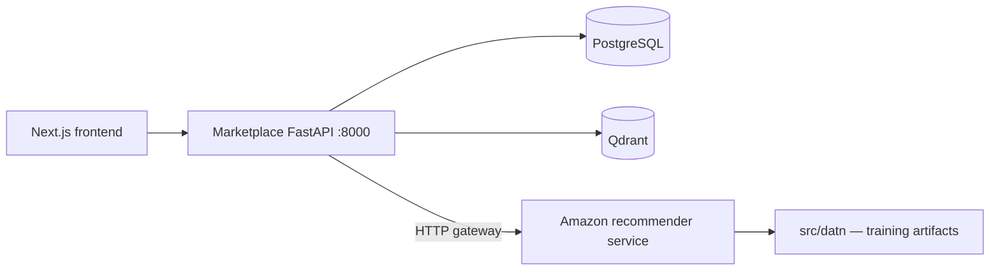

# Backend mini marketplace

Backend đặt riêng tại `backend/`, tách khỏi `src/datn/` để không ảnh hưởng ETL,
huấn luyện hoặc checkpoint model. Công nghệ: FastAPI, SQLAlchemy, PostgreSQL,
Qdrant và Docker Compose.

## Bounded contexts

| Context | PostgreSQL | Endpoint chính |
|---|---|---|
| Identity | `users` | register, login, me |
| Catalog | `categories`, `products` | list/detail, admin create |
| Cart | `carts`, `cart_items` | add/remove/view |
| Order | `orders`, `order_items` | checkout, history |
| Similarity | Qdrant `product_embeddings` | vector upsert, similar products |
| Recommendation | Không lưu artifact tại marketplace | gateway sang service tuần tự Amazon |

Checkout dùng row lock PostgreSQL để xác nhận tồn kho, giảm stock và snapshot giá
trong cùng transaction. Nó chỉ tạo order `PENDING`; payment provider là phần ngoài
phạm vi demo. Qdrant chỉ lưu vector/payload `product_id`, còn canonical product/giá
vẫn thuộc PostgreSQL.
