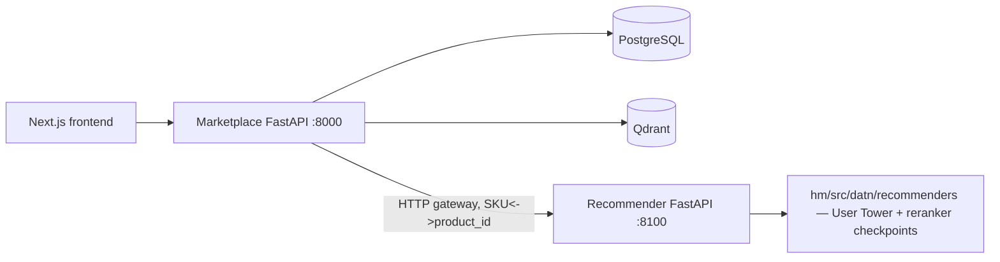

# Backend mini marketplace

Backend đặt riêng tại `hm/apps/backend/`, tách khỏi `hm/src/datn/` để không ảnh hưởng ETL,
huấn luyện hoặc checkpoint model. Công nghệ: FastAPI, SQLAlchemy, PostgreSQL,
Qdrant và Docker Compose.

## Bounded contexts

| Context | PostgreSQL | Endpoint chính |
|---|---|---|
| Identity | `users` | register, login, me, update profile, change password |
| Catalog | `categories`, `products` | list/detail, admin create |
| Cart | `carts`, `cart_items` | add/remove/view |
| Order | `orders`, `order_items` | checkout, history |
| Similarity | Qdrant `product_embeddings` | vector upsert, similar products |
| Recommendation | Không lưu artifact tại marketplace | gateway sang `hm/apps/recommender/` (retrieval+reranking), fallback Qdrant rồi catalog popularity |

`hm/apps/recommender/` (không thuộc marketplace) là service FastAPI riêng nạp
checkpoint User Tower (`data/artifacts/user_tower_balanced_v1/`) và reranker
(`data/artifacts/reranker_v2/`) trực tiếp từ đĩa — đây là service duy nhất
được phép import `hm/src/datn`. Nó nhận diện sản phẩm qua SKU (ASIN), không biết
gì về `Product.id` của Postgres; marketplace dịch hai chiều `Product.id <->
Product.sku` quanh mỗi lần gọi. Khi service này không phản hồi (hoặc lịch sử
người dùng toàn item ngoài tập huấn luyện), marketplace rơi về Qdrant (vector
nội dung CLIP thật đã index qua `legacy/scripts/index_qdrant_vectors.py`), rồi cuối
cùng là top sản phẩm đa dạng theo danh mục.

Checkout dùng row lock PostgreSQL để xác nhận tồn kho, giảm stock và snapshot giá
trong cùng transaction. Nó chỉ tạo order `PENDING`; payment provider là phần ngoài
phạm vi demo. Qdrant chỉ lưu vector/payload `product_id`, còn canonical product/giá
vẫn thuộc PostgreSQL.
